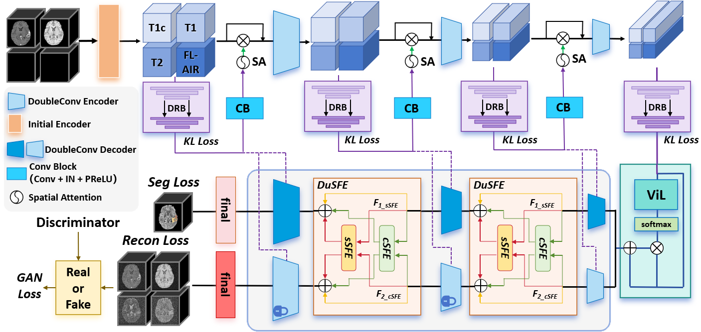

# [ISBI 2025 Accept🎇] XLSTM-HVED: Cross-Modal Brain Tumor Segmentation and MRI Reconstruction Method Using Vision XLSTM and Heteromodal Variational Encoder-Decoder
The XLSTM-HVED is a PyTorch-based model for cross-modal brain tumor segmentation and MRI reconstruction, designed to address missing MRI modality issues in neuroglioma treatment. It integrates a Heterogeneous Variational Encoder-Decoder (HVED) and Vision XLSTM to leverage spatiotemporal features and enhance the fusion of available MRI modalities. The model incorporates a Single-Multimodal Variational Auto-Encoder (S-MVAE) to fuse multimodal features and a Squeeze-Fusion-Excitation Cross Awareness (SFECA) module to optimize interactions between segmentation and reconstruction tasks. This approach improves segmentation accuracy even with incomplete data, as demonstrated on the BraTS 2024 dataset​.

<br><br>

<br><br>

## Pre-requisties
- Linux
- python==3.10
- NVIDIA GPU (memory>=18G) + CUDA cuDNN

## How to train
### Preparation of the data and environment
You only need to put the BraTS2024 Dataset into ./Dataset and divide it to train and test. Then use requirements.txt to install environment.
```
pip install requirements.txt
```

### Pretrain Recon decoder of XLSTM-HVED
```
python Pretrain.py
```

### Train XLSTM-HVED
```
python train.py
```


### Evaluate the model
```
python test.py
```

## Citation
```
@inproceedings{zhu2025xlstm,
  title={XLSTM-HVED: Cross-Modal Brain Tumor Segmentation and MRI Reconstruction Method Using Vision Xlstm and Heteromodal Variational Encoder-Decoder},
  author={Zhu, Shenghao and Chen, Yifei and Jiang, Shuo and Chen, Weihong and Liu, Chang and Wang, Yuanhan and Chen, Xu and Ke, Yifan and Qin, Feiwei and Wang, Changmiao and others},
  booktitle={2025 IEEE 22nd International Symposium on Biomedical Imaging (ISBI)},
  pages={1--5},
  year={2025},
  organization={IEEE}
}
```
