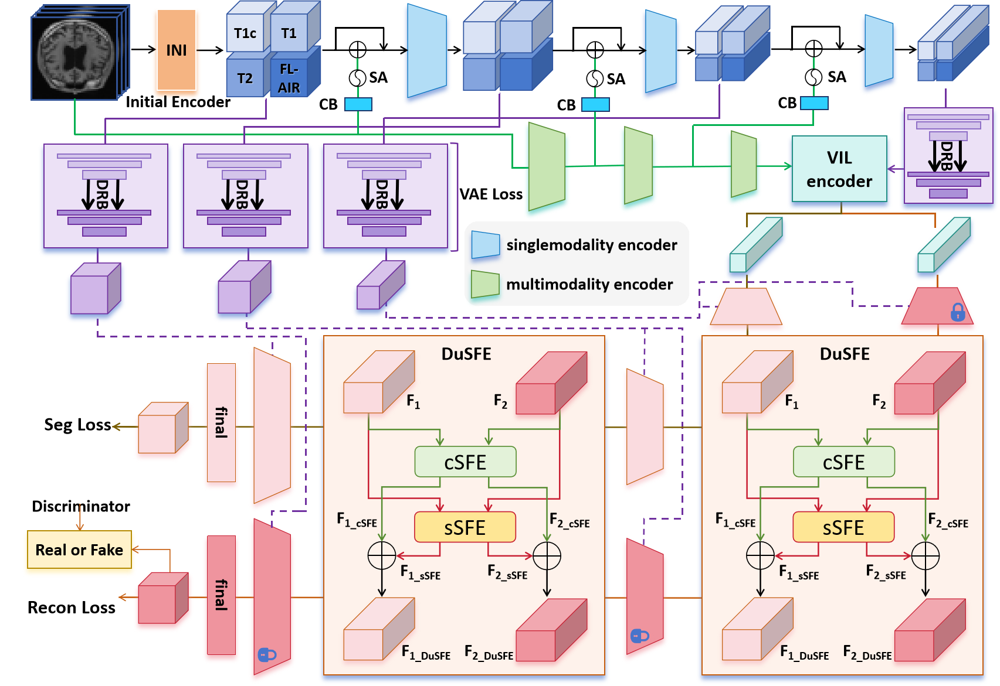

# **XLSTM-HVED**
The **XLSTM-HVED** is a PyTorch-based model for cross-modal brain tumor segmentation and MRI reconstruction, designed to address missing MRI modality issues in neuroglioma treatment. It integrates a Heterogeneous Variational Encoder-Decoder (HVED) and Vision XLSTM to leverage spatiotemporal features and enhance the fusion of available MRI modalities. The model incorporates a Single-Multimodal Variational Auto-Encoder (S-MVAE) to fuse multimodal features and a Squeeze-Fusion-Excitation Cross Awareness (SFECA) module to optimize interactions between segmentation and reconstruction tasks. This approach improves segmentation accuracy even with incomplete data, as demonstrated on the BraTS 2024 dataset​.

、  

  

